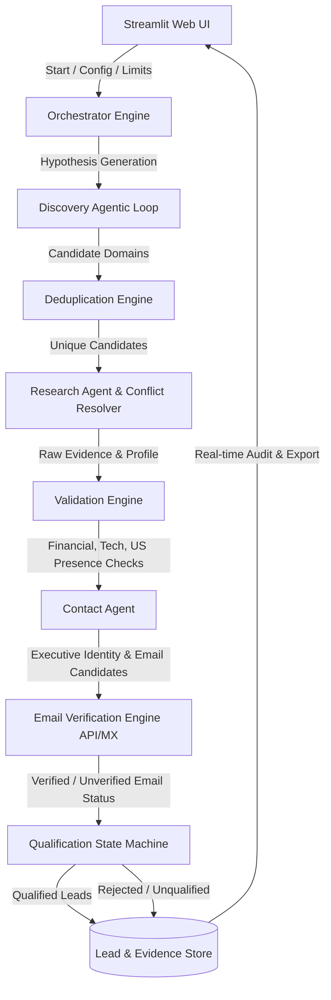
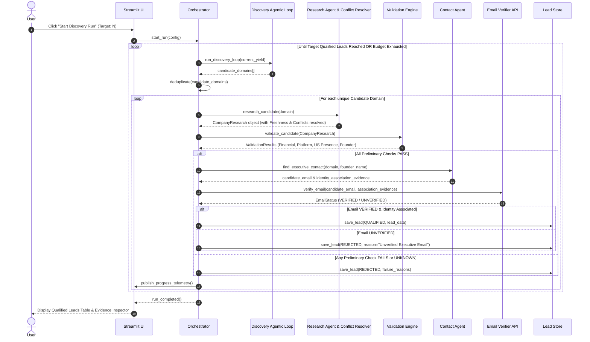
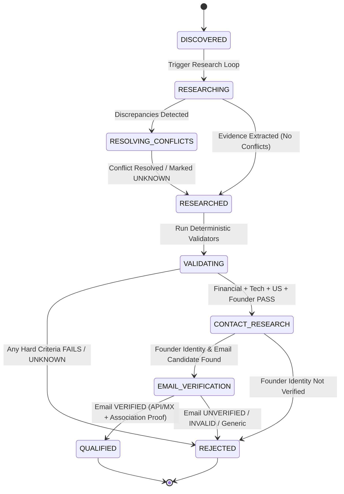

# TVB AGENT — SYSTEM ARCHITECTURE DESIGN (PHASE 1.1 HARDENED)

## 1. System Overview

The TVB Agentic AI system is an autonomous, evidence-first deal sourcing platform designed to discover, research, validate, and extract executive contacts for technology companies meeting TVB's investment criteria.

### High-Level Architecture Diagram


---

## 2. Component Architecture

The architecture is divided into decoupled, modular components with strict boundaries:

1. **User Interface Layer (`app/streamlit_app.py`)**: Stateless presentation layer providing run controls, progress telemetry, tabular output display, evidence inspection modals, and CSV/JSON export.
2. **Orchestration Layer (`agents/orchestrator.py`)**: Asynchronous state machine driving candidate lifecycle transitions, managing execution budgets, coordinating agent calls, and ensuring deterministic logic checks override probabilistic LLM outputs.
3. **Iterative Discovery Engine (`agents/discovery_agent.py`)**: Executes an autonomous agentic loop:
   `Generate Search Hypothesis -> Search -> Analyze Results -> Extract Candidates -> Identify Discovery Gaps -> Generate New Search Hypothesis -> Search Again`.
4. **Research Agent & Conflict Resolver (`agents/research_agent.py`)**: Performs multi-angle web research per candidate, retrieving official company content, news releases, and profile metadata. Contains an explicit **Conflict Resolution Engine** to detect, evaluate, and resolve conflicting claims across sources based on source tiering and recency.
5. **Validation Engine (`validators/`)**: Independent deterministic checkers:
   - `FinancialValidator`: Validates revenue/funding against $1M–$5M USD threshold. Distinguishes total funding/revenue from valuation, employee count, estimated revenue, or single funding round amounts.
   - `PlatformValidator`: Verifies genuine tech product/platform status vs. traditional business.
   - `USPresenceValidator`: Evaluates US presence vs. minimal/no US operations.
   - `FounderValidator`: Verifies CEO or Co-founder identity and role.
6. **Executive Contact & Email Verification Engine (`agents/contact_agent.py` & `tools/email_verification.py`)**:
   - Executes 3-stage executive protocol: (A) Executive Identity Verification, (B) Executive-Email Association, and (C) Technical Email Validation via Email Verification API / provider (with MX fallback). Rejects generic emails (`info@`, `contact@`, etc.).
7. **Lead & Evidence Store (`storage/lead_store.py`)**: Thread-safe in-memory and persistent SQLite/JSON store holding candidates, audit trails, conflict logs, and evidence records.

---

## 3. Agent Responsibilities

| Agent / Module | Primary Responsibility | Input | Output | Fallback Behavior |
| :--- | :--- | :--- | :--- | :--- |
| **Orchestrator** | Execution flow control, lifecycle management, budget enforcement | User Config (Target, Limits) | Execution Telemetry & Lead Store state | Gracefully stop on budget exhaustion |
| **Discovery Loop Agent** | Hypothesis generation & dynamic candidate harvesting | Sector/Geo criteria & discovery yield gaps | Candidate Domains + Source Metadata | Generate new search hypotheses |
| **Research Agent** | Multi-source evidence gathering & conflict resolution | Candidate Domain | `CompanyResearch` with `Evidence[]` | Mark missing/conflicting fields as `UNKNOWN` |
| **Validation Engine** | Programmatic evaluation of 5 Hard Criteria | `CompanyResearch` object | `ValidationResult` (PASS / FAIL / UNKNOWN) | Return `UNKNOWN` / `FAIL` conservatively |
| **Contact Agent** | Founder identity proof & email association discovery | Validated Candidate | `ExecutiveProfile` & Email candidate list | Leave email blank if unverified |
| **Email Verifier API** | Technical deliverability & association verification | Executive Email String | `VERIFIED` / `UNVERIFIED` / `INVALID` | Default conservatively to `UNVERIFIED` |

---

## 4. Data Flow



---

## 5. State Machine

Candidate state transitions are strictly governed by the state machine below:



---

## 6. Data Models

Defined using Pydantic models for explicit schema validation:

### 6.1 `Evidence` Model
```python
class Evidence(BaseModel):
    source_url: str
    source_title: str
    source_type: str  # "company_website", "press_release", "registry", "news"
    claim: str
    evidence_text: str
    source_published_date: Optional[str]  # e.g., "2024-05-10"
    accessed_at: str  # ISO 8601 timestamp
    freshness_status: str  # "CURRENT", "STALE", "UNKNOWN"
    source_tier: str  # "Tier_1", "Tier_2", "Tier_3", "Tier_4"
    confidence: float  # 0.0 to 1.0
    verification_method: str  # "DIRECT_EXTRACTION", "CROSS_CHECK", "API_CHECK"
    evidence_conflict_id: Optional[str] = None
```

### 6.2 `CompanyResearch` Model
```python
class FinancialsData(BaseModel):
    financial_type: str  # "revenue", "funding", "unknown"
    amount: float
    currency: str
    normalized_usd: float
    is_in_range: bool  # True if $1M <= normalized_usd <= $5M
    evidence: List[Evidence]

class USPresenceData(BaseModel):
    status: str  # "VERIFIED_NO_US_PRESENCE", "MINIMAL_US_PRESENCE", "SIGNIFICANT_US_PRESENCE", "NO_EVIDENCE_OF_US_PRESENCE"
    headquarters_country: str
    office_locations: List[str]
    evidence: List[Evidence]

class ExecutiveData(BaseModel):
    full_name: Optional[str]
    role: Optional[str]  # Must be "CEO", "Co-founder", or "CEO & Co-founder"
    identity_verified: bool  # True if active CEO/Co-founder identity proven
    evidence: List[Evidence]

class ExecutiveEmailData(BaseModel):
    email: Optional[str]
    verification_status: str  # "VERIFIED", "UNVERIFIED", "INVALID"
    verification_method: str  # "VERIFICATION_API", "MX_AND_ASSOCIATION", "UNVERIFIED"
    is_generic: bool
    association_evidence: List[Evidence]
    technical_validation_evidence: List[Evidence]

class CompanyResearch(BaseModel):
    domain: str
    company_name: str
    website_url: str
    description: str
    industry_sector: str
    is_tech_platform: bool
    platform_evidence: List[Evidence]
    financials: FinancialsData
    us_presence: USPresenceData
    executive: ExecutiveData
    executive_email: ExecutiveEmailData
    all_evidence: List[Evidence]
    conflicts: List[Dict[str, Any]]
```

---

## 7. Validation & Executive Contact Protocol

### 7.1 Programmatic Qualification Logic
- Deterministic Python validators execute outside the LLM:
  `QUALIFIED = Financial.PASS AND Platform.PASS AND USPresence.PASS AND Founder.PASS AND ExecutiveEmail.VERIFIED`
- Any criterion returning `FAIL` or `UNKNOWN` leads to immediate candidate disqualification.

### 7.2 Three-Stage Executive Email Protocol
1. **Executive Identity Verification:** Prove that the identified individual is currently the active CEO or Co-founder of the company (filtering out past/resigned executives).
2. **Executive-Email Association:** Identify reliable public evidence (company bio, press release, publication, SEC/regulatory filing) explicitly linking the exact email string to the executive.
3. **Technical Email Validation:** Verify technical deliverability via a legitimate Email Verification API / provider (or MX record check).
   - *Pattern Note:* Pattern-generated email strings (e.g. `jane.doe@company.com`) are candidate hypotheses only. They cannot be marked `VERIFIED` without passing both association proof and technical deliverability checks.

---

## 8. Source Freshness & Conflict Resolution

### 8.1 Source Quality Tiering
- **Tier 1 (Highest Confidence - 1.0):** Official company website, official regulatory filings (UK Companies House, EU registries).
- **Tier 2 (High Confidence - 0.85):** Reputable funding databases (Crunchbase/PitchBook public records), major financial publications (TechCrunch, Reuters, Bloomberg, EU-Startups).
- **Tier 3 (Medium Confidence - 0.65):** Public professional profiles, regional tech portals.
- **Tier 4 (Low Confidence - 0.30):** Aggregators, generic blogs.

### 8.2 Conflict Resolution Process
```
Detect Discrepancy Across Sources
↓
Flag evidence_conflict_id
↓
Execute Secondary Targeted Research Query
↓
Evaluate Source Tiers (Tier 1 > Tier 2 > Tier 3) AND Freshness (Recent > Stale)
↓
IF High-Confidence Resolution Achieved -> Update Field
ELSE -> Set Field Status to UNKNOWN & Disqualify Lead
```

---

## 9. API & Provider Abstraction

All external services implement abstract base class interfaces:

```python
class SearchProvider(ABC):
    @abstractmethod
    def search(self, query: str, num_results: int = 10) -> List[Dict]:
        pass

class LLMProvider(ABC):
    @abstractmethod
    def complete(self, prompt: str, schema: Optional[Type[BaseModel]] = None) -> Any:
        pass

class EmailVerificationProvider(ABC):
    @abstractmethod
    def verify(self, email: str, domain: str) -> Dict[str, Any]:
        pass
```

- Email verification primary/fallback defaults to an Email Verification API (e.g. Hunter/ZeroBounce) or MX lookup rather than direct port 25 SMTP sockets.

---

## 10. Technology Stack Recommendation

| Layer | Recommended Technology | Rationale |
| :--- | :--- | :--- |
| **Language & Runtime** | Python 3.11 | Async scheduling, Pydantic data validation |
| **Frontend UI** | Streamlit | Fast Python web UI, real-time telemetry |
| **LLM Provider** | Google Gemini API (`google-genai`) | Structured JSON extraction, fast inference |
| **Search Engine API** | SerpAPI / Tavily API | High reliability web search for dynamic hypothesis loop |
| **Email Verification** | Pluggable Verification API + MX Lookup | Bypasses Port 25 cloud blocking, ensures deliverability |
| **Storage Layer** | SQLite + In-Memory Store | Lightweight, zero external database dependency |

---

## 11. Important Trade-offs & Limitations

1. **Conservative Qualification Quality:** Conservative, evidence-based qualification designed to minimize false positives over raw volume.
2. **Cloud SMTP Limitations:** Direct socket handshakes on Port 25 are frequently blocked on cloud hosts (Vercel, Render, Streamlit Cloud). Production architecture prioritizes verification APIs and MX record validation.
